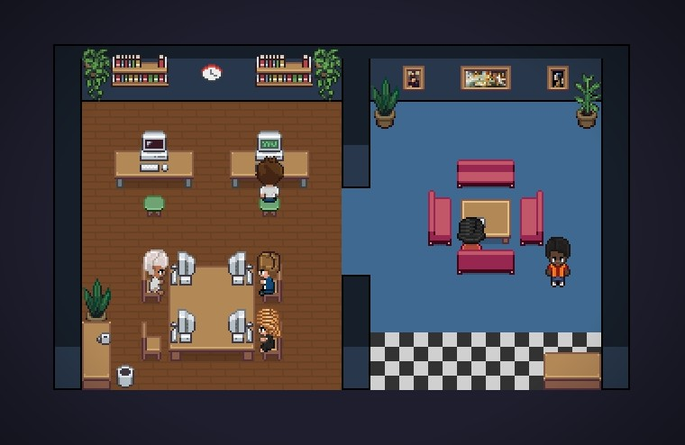

# Pixel World

Pixel art office where your Claude Code agents come to life as animated characters.



## Features

- **Live Agent Visualization** — Each Claude Code terminal appears as an animated pixel art character walking, typing, and reading in your virtual office
- **Auto-Detection** — New Claude Code sessions are automatically detected and spawn characters without manual setup
- **Real-Time Tool Tracking** — See what each agent is doing: reading files, writing code, running bash commands, waiting for permission
- **Cross-Window Sync** — Agents and user characters from other VS Code windows appear in your office with their correct appearance
- **Interactive Office Editor** — Design your workspace with floor patterns, walls, furniture, and decorations
- **Sound Notifications** — Audio chime when an agent completes its turn
- **6 Character Palettes** — Diverse skins with automatic hue-shifting for additional agents beyond 6
- **Sub-Agent Support** — Nested Task tool sub-agents spawn as child characters near their parent
- **Layout Persistence** — Office layout saved to `~/.pixel-agents/layout.json`, shared across all workspaces

## Install

Install from the [VS Code Marketplace](https://marketplace.visualstudio.com/items?itemName=luongwnv.pixel-agents) or search "Pixel World" in the Extensions panel.

## Usage

1. Open the **Pixel World** panel (appears in the sidebar/panel area)
2. Click **+ Agent** to launch a Claude Code terminal, or just start Claude Code from any terminal — characters are created automatically
3. Click a character to focus its terminal. Hover to see detailed tool activity
4. Click **Layout** to enter the office editor

### Layout Editor

| Tool | Action |
|------|--------|
| **Floor** | Paint floor tiles with 7 patterns + HSBC color sliders |
| **Wall** | Click/drag to add walls, click existing walls to remove |
| **Erase** | Set tiles to void (transparent, non-walkable) |
| **Furniture** | Place items from the catalog. **R** to rotate, **T** to toggle on/off state |
| **Select** | Drag furniture to move. Color sliders for selected items |
| **Eyedropper** | Pick floor pattern/color or furniture type from placed items |

- **Ctrl+Z / Ctrl+Y** — Undo / Redo (50 levels)
- **Right-click** — Erase to void in floor/wall/erase tools
- **Ghost border** — Click outside the grid to expand (up to 64×64)
- **Esc** — Multi-stage exit: deselect → close tab → exit editor

### Agent Interaction

- **Click** a character to select and focus its terminal
- **Click** an empty seat while a character is selected to reassign it
- **Hover** over the status label to see full tool details
- **Middle-mouse drag** to pan the camera
- **+/−** buttons (top-right) to zoom

## Configuration

In VS Code Settings → "Pixel World":

| Setting | Description |
|---------|-------------|
| `pixelAgents.claudeModel` | Claude model to use when launching agents (e.g. `claude-sonnet-4-6`). Leave empty for CLI default |

## Build from Source

```bash
# Install dependencies
npm install
cd webview-ui && npm install && cd ..

# Build extension + webview
npm run build

# Development: watch mode
npm run watch
```

Press **F5** in VS Code to launch the Extension Development Host.

## Architecture

```
src/                          — Extension backend (Node.js, VS Code API)
  extension.ts                — Entry: activate(), deactivate()
  PixelAgentsViewProvider.ts  — WebviewViewProvider, message dispatch
  agentManager.ts             — Terminal lifecycle, agent persistence
  agentSyncManager.ts         — Cross-window agent sync via shared file
  userSyncManager.ts          — Cross-window user character sync
  fileWatcher.ts              — JSONL file watching + auto-detection
  transcriptParser.ts         — JSONL parsing → webview messages

webview-ui/src/               — React + TypeScript (Vite)
  App.tsx                     — Composition root
  office/engine/              — Game loop, character FSM, renderer
  office/editor/              — Layout editing tools
  office/layout/              — Furniture catalog, pathfinding, serialization
  office/sprites/             — Sprite data, caching, colorization
```

**Key concepts:**
- One agent per terminal, bound 1:1 to a Claude Code session
- JSONL transcripts at `~/.claude/projects/<project-hash>/<session-id>.jsonl`
- Layout persisted to `~/.pixel-agents/layout.json` (user-level, cross-workspace)
- Agent/user sync via `~/.pixel-agents/agents.json` and `users.json`

## License

MIT
